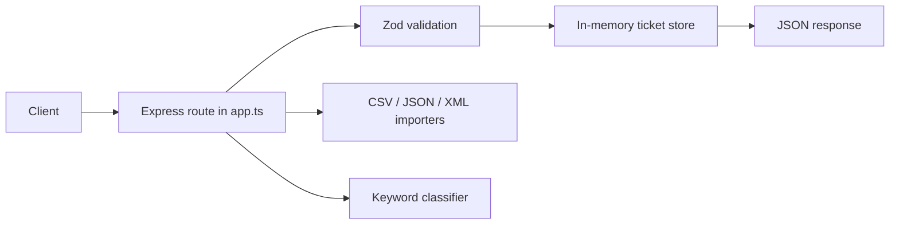

# Homework 2: Intelligent Customer Support System

> **Student Name**: Denys Ostrometskyi
> **Date Submitted**: 2026-05-04
> **AI Tools Used**: Claude Code (Claude Sonnet 4.6, Claude Opus 4.7), OpenAI Codex (GPT-5.4)

Lean REST API for support tickets built with TypeScript, Express, Zod, in-memory storage, deterministic auto-classification, and bulk import from CSV, JSON, and XML.

## What is implemented

- `POST /tickets` create ticket
- `GET /tickets` list tickets with filters
- `GET /tickets/:id` fetch single ticket
- `PUT /tickets/:id` partial update
- `DELETE /tickets/:id` delete ticket
- `POST /tickets/:id/auto-classify` classify existing ticket
- `POST /tickets/import` bulk import from `csv`, `json`, `xml`
- optional `?auto_classify=true` on create and bulk import

## Stack

- Node.js
- TypeScript
- Express
- Zod
- `csv-parse`
- `fast-xml-parser`
- `multer`
- Jest
- Supertest

## Project structure

```text
src/
  app.ts
  server.ts
  errors.ts
  classifier.ts
  models/ticket.ts
  store/ticketStore.ts
  importers/
tests/
  unit/
  integration/
  performance/
  fixtures/
docs/
  SPEC.md
  PLAN.md
  API_REFERENCE.md
  ARCHITECTURE.md
  TESTING_GUIDE.md
```

## Quick start

```bash
npm install
npm run dev
```

Server default URL:

```text
http://localhost:3000
```

Build and run compiled output:

```bash
npm run build
npm start
```

See [HOWTORUN.md](./HOWTORUN.md) for detailed setup, curl examples, and demo commands.

## Tests and coverage

Run all tests:

```bash
npm test
```

Run coverage:

```bash
npm run test:coverage
```

Latest verified coverage result:

```text
All files | Statements 97.6% | Branches 91.13% | Functions 100% | Lines 98.22%
```

## Sample data

Fixtures live in `tests/fixtures/`:

- `sample_tickets.csv`
- `sample_tickets.json`
- `sample_tickets.xml`
- `invalid_tickets.csv`
- `invalid_tickets.json`
- `invalid_tickets.xml`

## API examples

Create ticket:

```bash
curl -X POST http://localhost:3000/tickets \
  -H "Content-Type: application/json" \
  -d '{
    "customer_id": "cust-1",
    "customer_email": "alice@example.com",
    "customer_name": "Alice",
    "subject": "Login issue",
    "description": "I cannot login to my account for several days.",
    "metadata": {
      "source": "web_form",
      "browser": "Chrome 120",
      "device_type": "desktop"
    }
  }'
```

Bulk import with auto-classification:

```bash
curl -X POST "http://localhost:3000/tickets/import?auto_classify=true" \
  -F "file=@tests/fixtures/sample_tickets.csv"
```

Full endpoint details are in [docs/API_REFERENCE.md](./docs/API_REFERENCE.md).

## Project context

- [docs/SPEC.md](./docs/SPEC.md) — lean specification, source of truth for implementation
- [docs/PLAN.md](./docs/PLAN.md) — TDD phase-by-phase implementation plan

## AI tools and models used

| Phase / Artifact | Tool | Model | Effort |
|---|---|---|---|
| Phase 1-2 — Scaffold, ticket model | Claude Code | Claude Sonnet 4.6 | Medium |
| Phase 3 — Classifier | Claude Code | Claude Sonnet 4.6 | Medium |
| Phase 4-5 — Importers (CSV/JSON/XML), in-memory store | Claude Code | Claude Sonnet 4.6 | Medium |
| Phase 6 — Express API (CRUD, validation, filtering) | Claude Code | Claude Sonnet 4.6 | Medium |
| Phase 7 — Bulk import endpoint | OpenAI Codex | GPT-5.4 | Medium |
| Phase 8 — Fixtures, lifecycle and performance tests | OpenAI Codex | GPT-5.4 | Medium |
| Phase 9 — Coverage push to >85% | OpenAI Codex | GPT-5.4 | Medium |
| Phase 10 — Documentation (README, HOWTORUN, API_REFERENCE, TESTING_GUIDE) | Claude Code | Claude Sonnet 4.6 | Medium |
| Phase 10 — ARCHITECTURE.md (Mermaid diagrams, design tradeoffs) | Claude Code | Claude Opus 4.7 | High |
| Phase 11 — Final review against `TASKS.md` and `SPEC.md` | Claude Code | Claude Opus 4.7 | High |
| Post-review fixes | Claude Code | Claude Sonnet 4.6 | Medium |

Every prompt used `docs/SPEC.md` as the context source of truth. Phase-by-phase model and effort log with screenshot evidence is in [`docs/PLAN.md`](./docs/PLAN.md).

## Request flow


