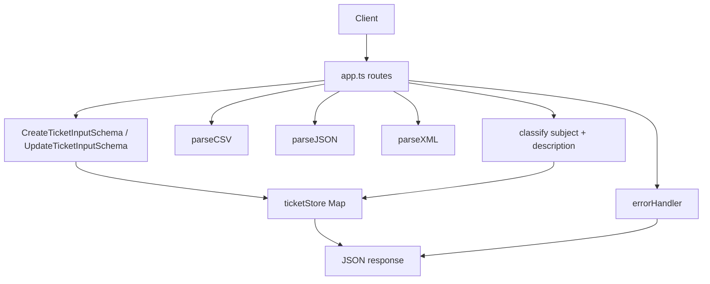
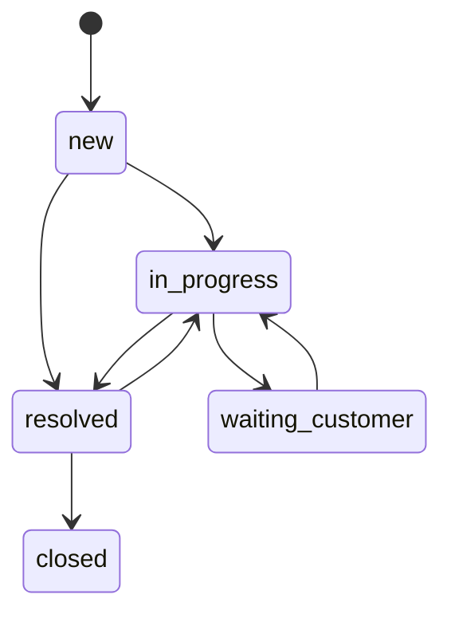
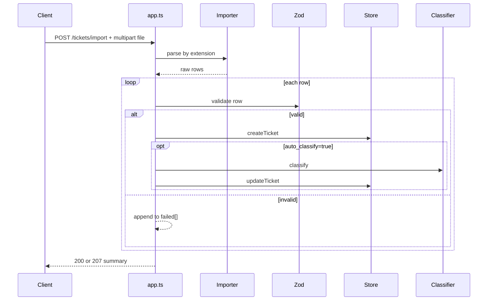

# Architecture

## Overview

The application is a small Express service with in-memory state. Request handlers live in `src/app.ts`. Validation is done with Zod. Bulk import parsing is delegated to pure importer modules. Auto-classification is a pure keyword-based function. Persistence is an in-memory `Map`, so data is lost on process restart.

## Main components

- `src/app.ts`: routes, request parsing, import orchestration, status codes
- `src/models/ticket.ts`: schemas, enums, TypeScript types
- `src/store/ticketStore.ts`: CRUD and filtering over an in-memory `Map`
- `src/classifier.ts`: deterministic classifier
- `src/importers/*.ts`: raw file parsers for CSV, JSON, XML
- `src/errors.ts`: error envelope for HTTP responses

## Runtime flow

## Ticket lifecycle

Implementation detail from `ticketStore.ts`:

- when status changes to `resolved`, `resolved_at` is set
- when status changes away from `resolved`, `resolved_at` is cleared

## Bulk import flow

## Storage model

The store is intentionally simple:

- data structure: `Map<string, Ticket>`
- id generation: `randomUUID()`
- timestamps: `new Date().toISOString()`
- no database
- no persistence across restarts

This matches the current code and test suite. No repository layer or service abstraction is implemented.

## Import formats

### CSV

- header-based parsing with `csv-parse`
- supports dotted metadata keys such as `metadata.source`
- `tags` are split by `;`

### JSON

- root must be an array
- malformed JSON returns `400`

### XML

- root must be `<tickets>`
- records are `<ticket>`
- tags are read from `<tags><tag>...</tag></tags>`

## Error handling

Current error handling behavior:

- `HttpError` preserves status code and error code
- `ZodError` becomes `400 VALIDATION_ERROR`
- unexpected errors become `500 INTERNAL_ERROR`

## Performance profile

The verified test suite includes lightweight checks for:

- `25` concurrent creates
- bulk import of `50` CSV rows
- bulk import of `20` JSON rows
- bulk import of `30` XML rows
- repeated classifier calls

These are benchmark-style sanity checks, not production SLAs.
