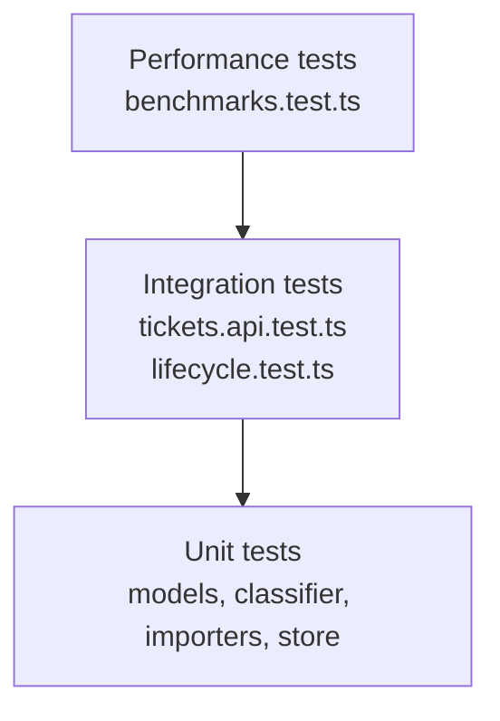

# Testing Guide

## Test stack

- Jest
- ts-jest
- Supertest

Config is in `jest.config.ts`.

## Test layout

```text
tests/
  unit/
    ticket.model.test.ts
    classifier.test.ts
    csv.importer.test.ts
    json.importer.test.ts
    xml.importer.test.ts
    ticketStore.test.ts
  integration/
    tickets.api.test.ts
    lifecycle.test.ts
  performance/
    benchmarks.test.ts
  fixtures/
    sample_tickets.csv
    sample_tickets.json
    sample_tickets.xml
    invalid_tickets.csv
    invalid_tickets.json
    invalid_tickets.xml
```

## What is covered

### Unit tests

- ticket input validation and defaults
- classifier rules and confidence
- CSV, JSON, XML parser behavior
- in-memory store lifecycle and status transitions

### Integration tests

- CRUD endpoints
- filter behavior
- `404`, `400`, `415`, `207`
- auto-classification
- bulk import for CSV, JSON, XML
- end-to-end ticket lifecycle

### Performance tests

- `25` concurrent creates
- fixture-based bulk imports
- combined filtering on imported data
- repeated classifier execution

## Commands

Run all tests:

```bash
npm test
```

Run coverage:

```bash
npm run test:coverage
```

## Latest verified result

```text
Test Suites: 9 passed, 9 total
Tests: 137 passed, 137 total
Coverage: Statements 97.6%, Branches 91.13%, Functions 100%, Lines 98.22%
```

## Test pyramid



## Fixture usage

Sample fixtures are consumed by lifecycle and performance tests:

- `tests/fixtures/sample_tickets.csv` with `50` rows
- `tests/fixtures/sample_tickets.json` with `20` rows
- `tests/fixtures/sample_tickets.xml` with `30` rows

Invalid fixtures are available for malformed import scenarios:

- `tests/fixtures/invalid_tickets.csv`
- `tests/fixtures/invalid_tickets.json`
- `tests/fixtures/invalid_tickets.xml`

## Manual verification checklist

1. Run `npm install`.
2. Run `npm run dev`.
3. Create a ticket with `POST /tickets`.
4. Create a ticket with `?auto_classify=true`.
5. Import `tests/fixtures/sample_tickets.csv` through `POST /tickets/import?auto_classify=true`.
6. Check filters with `GET /tickets?category=technical_issue&priority=medium`.
7. Run `npm test`.
8. Run `npm run test:coverage`.

## Notes on coverage

Coverage is measured from `src/**/*.ts` and excludes `src/server.ts`, matching `jest.config.ts`.

The current coverage result is above the configured global line threshold of `85%`.
